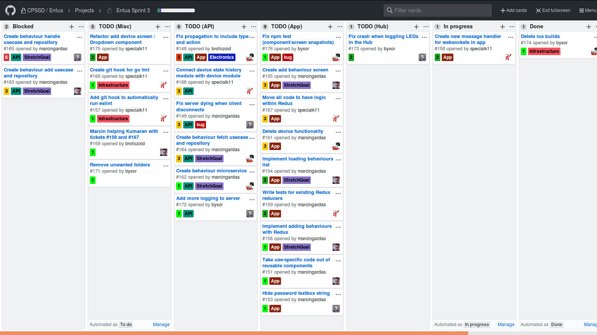
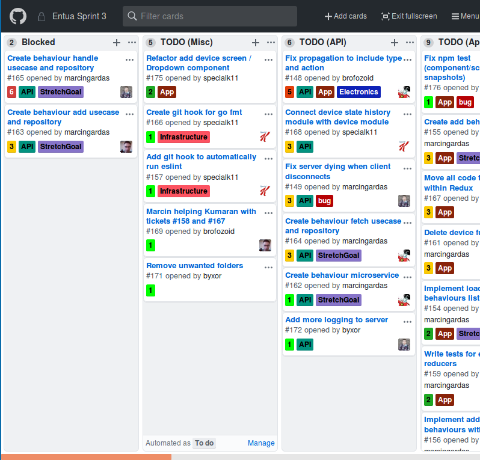

# compact-github-projects-theme

GitHub projects is a nice tool to manage a project's tasks, but a large portion of the screen space is wasted. This CSS allows you to see more at once.

# Demo

## Before:

## After:

