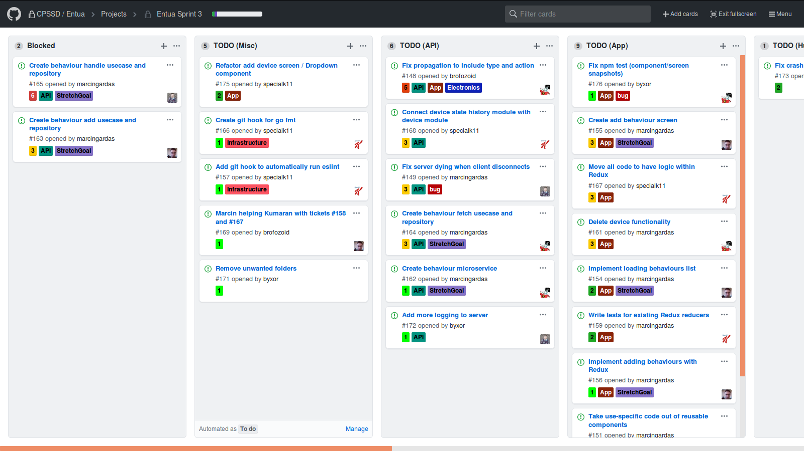
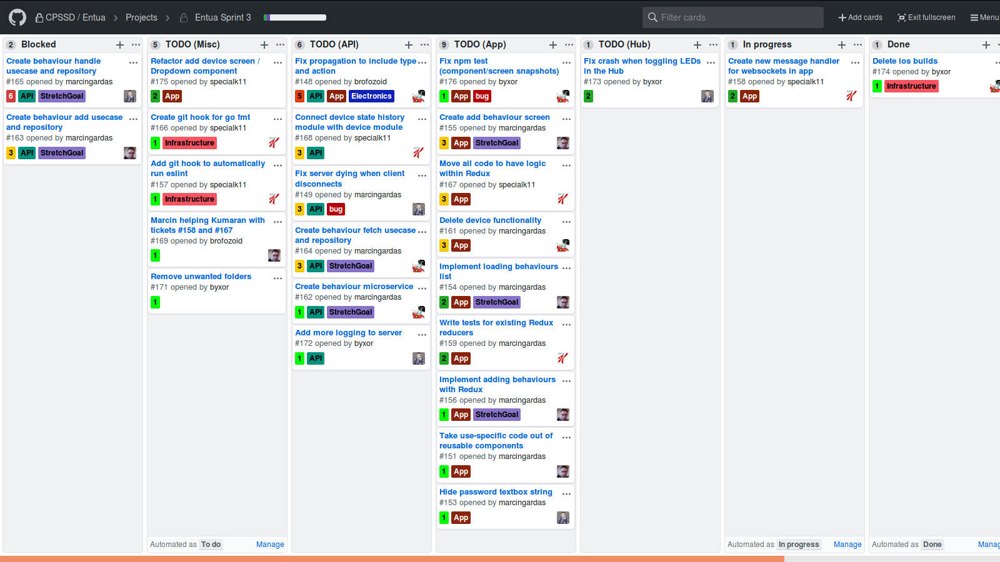

# compact-github-projects-theme

GitHub projects is a nice tool to manage a project's tasks, but a large portion of the screen space is wasted. This CSS allows you to see more at once.

## Demo

### Before:

### After:

## Installation

### 1. Get a CSS injection addon for your browser.

You can use Stylus for [Chrome](https://chrome.google.com/webstore/detail/stylus/clngdbkpkpeebahjckkjfobafhncgmne?hl=en) or [Firefox](https://addons.mozilla.org/en-US/firefox/addon/styl-us/).

Don't use Stylish, [it's spyware](https://www.reddit.com/r/programming/comments/8vpqqg/stylish_browser_extension_steals_all_your/).

### 2. Copy the fixed CSS into the CSS injector.

The fixed CSS is in the `fix.css` file.

